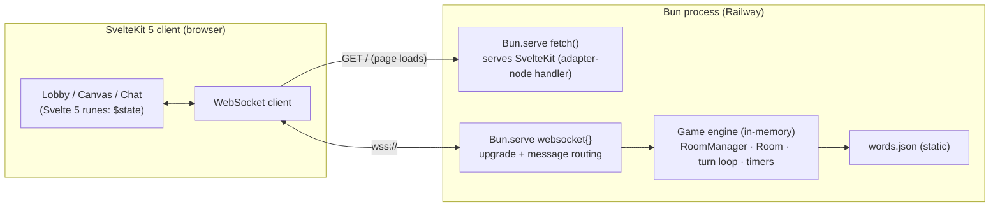
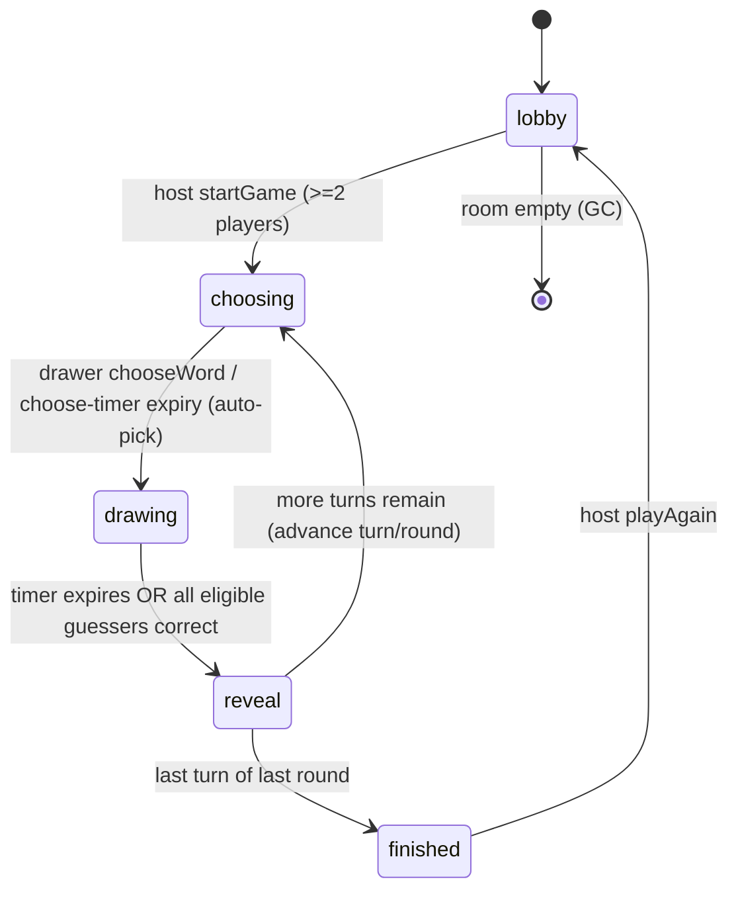
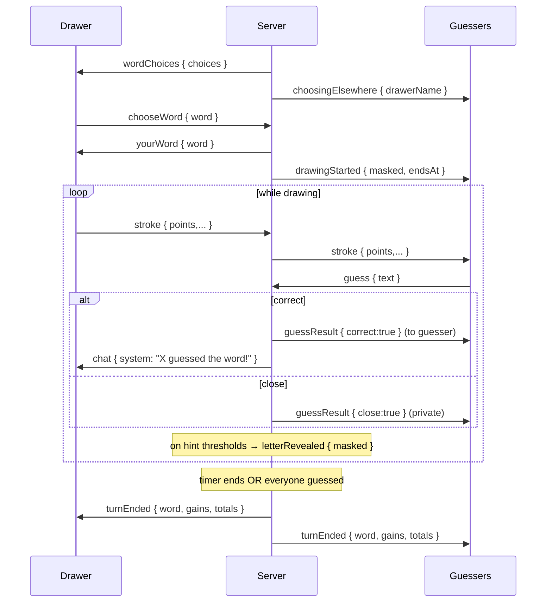

# Technical Requirements Document — Drawing Game (Skribbl Clone)

**Status:** Draft v1
**Companion:** See PRD.md for product scope.
**Stack:** Bun · SvelteKit 5 · Bun-native WebSockets · Railway · (no database in v1)

---

## 1. Summary

A single, stateful, always-on server holds all game state in memory and coordinates each room over WebSockets. The client is a SvelteKit 5 app: a landing page plus a `/game/[code]` room view with a drawing canvas and chat. There is **no database** in v1 — game state is ephemeral and the word list is a static asset. The whole thing runs as one Bun process.

## 2. Architecture Overview



**Key properties**

- **One authority.** All mutable game state (turn, word, timer, scores, strokes) lives in the server process. Clients are thin views that render server-pushed state and emit intents. Clients never decide scoring, timing, or correctness.
- **In-memory only.** State is a `Map<roomCode, Room>`. Empty rooms are garbage-collected. A process restart drops all live games — acceptable for this use case.
- **Same origin.** The SvelteKit app and the WebSocket endpoint are served by the same Bun process, so no CORS and one URL to deploy.

## 3. Tech Stack & Rationale

| Concern | Choice | Why |
|---|---|---|
| Runtime | **Bun** | First-class, fast native WebSocket server (`Bun.serve`); single toolchain you already use. |
| Frontend | **SvelteKit 5** | Routing for home + `/game/[code]`; Svelte 5 runes (`$state`, `$derived`) map cleanly to live game state. |
| SvelteKit adapter | **`adapter-node`** | Produces a Node/Bun-runnable handler you can mount inside a custom `Bun.serve`. |
| Realtime transport | **Bun-native WebSockets** | No extra service or dependency; pub/sub topics built in (see §7). |
| Hosting | **Railway** | Long-running process (no scale-to-zero cold starts), git-push deploy, single service. |
| Persistence | **None (v1)** | All state is ephemeral; word list is static. `bun:sqlite` reserved for future (see §12). |
| Canvas | **HTML `<canvas>` + Pointer Events** | Framework-agnostic; strokes are plain data we relay. |

## 4. Deployment & the Serverless Question (decision record)

**Constraint.** The game requires a persistent, stateful, always-on process: long-lived WebSocket connections and in-memory room state that must stay consistent for everyone in a room. **Serverless functions (Netlify Functions, AWS Lambda) cannot host a WebSocket server** — they're short-lived, stateless, and can't hold a persistent socket. This is the acute version of the scale-to-zero problem.

**Options considered**

1. **✅ Recommended — single service on Railway.** One Bun process runs both the SvelteKit app (`adapter-node` handler) and the WebSocket server via `Bun.serve({ fetch, websocket })`. All state in memory, no DB, one origin, deploy by git push. Railway keeps it warm as a long-running process — no cold starts. Simplest to reason about.
2. **Split — static frontend on Netlify + WS server on Railway/Fly.** Gains Netlify's CDN, but costs a second deploy target, cross-origin/CORS config, and a `PUBLIC_WS_URL` env to thread through. No real benefit at this scale.
3. **PartyKit (worth knowing).** Purpose-built for exactly this: per-room stateful servers on Cloudflare Durable Objects, room state in memory, minimal ops. Arguably the most natural fit for a Skribbl clone. Tradeoffs: a new platform (Cloudflare, not Railway) and server code shaped around its "party" model. **Mitigation:** keep the game engine transport-agnostic (§6) so a port stays cheap if you ever want it.

**Decision:** Option 1 for v1. Structure the engine so Option 3 remains a low-cost pivot.

## 5. Project Structure

```
drawing-game/
├─ src/                        # SvelteKit app (client + minimal load logic)
│  ├─ routes/
│  │  ├─ +page.svelte          # Home: Create / Join
│  │  └─ game/[code]/+page.svelte   # Room: lobby → play → results
│  └─ lib/
│     ├─ realtime/client.ts    # WS client wrapper (connect, send, on-message)
│     ├─ protocol.ts           # SHARED message types (client ⇄ server)
│     └─ components/           # Canvas, PlayerList, Chat, Timer, Scoreboard, WordBlanks
├─ server/
│  ├─ index.ts                 # Bun.serve: fetch (SvelteKit) + websocket handlers
│  ├─ engine/
│  │  ├─ RoomManager.ts        # Map<code, Room>, create/join/leave, GC
│  │  ├─ Room.ts               # per-room state + turn loop + timers
│  │  ├─ scoring.ts            # pure scoring functions
│  │  ├─ words.ts              # load + sample from words.json
│  │  └─ mask.ts               # word masking + progressive reveal
│  └─ protocol.ts              # re-exports src/lib/protocol.ts (single source of truth)
├─ static/ or server/data/words.json
├─ build/                      # adapter-node output (prod)
└─ package.json
```

> `protocol.ts` is imported by **both** client and server so message shapes can never drift. Keep it dependency-free.

## 6. Server Model (in-memory types)

Types are illustrative TypeScript — the shapes matter more than exact syntax.

```ts
type PlayerId = string; // assigned by server on connect

interface Player {
  id: PlayerId;
  name: string;
  score: number;              // cumulative across the game
  isHost: boolean;
  connected: boolean;
  guessedThisTurn: boolean;   // reset each turn
  guessedAtMs?: number;       // timestamp of correct guess (for scoring/order)
}

interface Settings {
  rounds: number;             // default 3
  drawTimeSeconds: number;    // default 80
  wordChoiceCount: number;    // default 3
  hintCount: number;          // default 2
  maxPlayers: number;         // default 12
  wordSource: 'builtin' | 'custom' | 'both';
  customWords: string[];      // used when source includes custom
}

type Phase = 'lobby' | 'choosing' | 'drawing' | 'reveal' | 'finished';

interface Stroke {
  points: [number, number][]; // normalized 0..1 coordinates
  color: string;
  width: number;
}

interface TurnState {
  drawerId: PlayerId;
  choices?: string[];         // during 'choosing' (server-side only)
  word?: string;              // secret; never serialized to guessers
  masked: string;             // what guessers see, e.g. "_ _ a _"
  revealedIndexes: number[];  // which letter positions are shown
  endsAt: number;             // epoch ms; authoritative deadline
  timer?: Timer;              // Bun/Node timer handle
}

interface Room {
  code: string;
  hostId: PlayerId;
  phase: Phase;
  players: Map<PlayerId, Player>;
  settings: Settings;
  round: number;              // 1..settings.rounds
  turnOrder: PlayerId[];      // established at game start
  turnIndex: number;          // position within turnOrder
  turn?: TurnState;
  strokes: Stroke[];          // current turn only; cleared each turn
  usedWords: Set<string>;     // avoid repeats within a game
}
```

**Serialization rule:** never send `word`, `choices`, or `revealedIndexes`-derived answers to a client that shouldn't have them. The drawer receives the real word; guessers receive only `masked`. Build a per-recipient view (`toClientState(room, recipientId)`), don't broadcast the raw `Room`.

## 7. WebSocket Protocol

Bun's `Bun.serve` exposes pub/sub: `ws.subscribe(topic)` and `server.publish(topic, msg)`. Use one topic per room (`room:<code>`) for broadcasts, plus direct `ws.send` for recipient-specific payloads (word choices, the drawer's word, private "you're close" hints).

All messages are JSON: `{ "type": string, ...payload }`. `type` is a discriminant so client/server can switch exhaustively.

### 7.1 Client → Server

| `type` | Payload | Sender | Notes |
|---|---|---|---|
| `join` | `{ code, name }` | any | First message after socket open; server assigns `PlayerId`. |
| `updateSettings` | `{ settings: Partial<Settings> }` | host | Lobby only. |
| `startGame` | `{}` | host | Requires ≥2 players; locks settings, builds `turnOrder`. |
| `chooseWord` | `{ word }` | drawer | Only during `choosing`, must be one of the offered choices. |
| `stroke` | `{ points, color, width }` | drawer | Batched points (see §9); relayed to room. |
| `clearCanvas` | `{}` | drawer | Clears server `strokes` + broadcasts. |
| `undo` | `{}` | drawer | *(nice-to-have)* pops last stroke. |
| `guess` | `{ text }` | non-drawer | Evaluated server-side (§10). |
| `chat` | `{ text }` | any | Non-guess chatter; scoped by server (§11). |
| `playAgain` | `{}` | host | From `finished` → back to `lobby`. |

### 7.2 Server → Client

| `type` | Payload | Target | Notes |
|---|---|---|---|
| `joined` | `{ you: PlayerId, room: ClientRoom }` | one | Ack + initial state snapshot. |
| `roomState` | `{ room: ClientRoom }` | room | Full resync (roster, phase, scores, settings). |
| `playerJoined` / `playerLeft` | `{ player }` / `{ id }` | room | Incremental roster updates. |
| `turnStarted` | `{ drawerId, round, turnIndex }` | room | Canvas resets; phase → `choosing`. |
| `wordChoices` | `{ choices }` | drawer only | The N options to pick from. |
| `choosingElsewhere` | `{ drawerName }` | non-drawers | "Alex is choosing a word…". |
| `drawingStarted` | `{ masked, endsAt }` | room | Phase → `drawing`; guessers get blanks only. |
| `yourWord` | `{ word }` | drawer only | The real word to draw. |
| `stroke` | `{ points, color, width }` | room (excl. drawer) | Relayed draw data. |
| `clearCanvas` / `undo` | `{}` | room | Mirror canvas ops. |
| `letterRevealed` | `{ masked }` | room | Updated mask as hints fire. |
| `guessResult` | `{ playerId, correct, close? }` | see §11 | Correctness hidden from non-guessers. |
| `chat` | `{ playerId, name, text, scope }` | scoped | `scope`: `all` \| `guessed` \| `system`. |
| `timeSync` | `{ endsAt }` | room | Periodic drift correction. |
| `turnEnded` | `{ word, gains: Record<PlayerId, number>, totals: Record<PlayerId, number> }` | room | Reveal + scoreboard data. |
| `gameEnded` | `{ finalTotals, winnerId }` | room | Phase → `finished`. |
| `error` | `{ code, message }` | one | e.g. room full, not found, not your turn. |

`ClientRoom` is the recipient-safe projection of `Room` (no secret word/choices).

## 8. Game Loop (state machine)



**Turn advancement.** After `reveal`, increment `turnIndex`. If it wraps past `turnOrder.length`, increment `round` and reset `turnIndex`. If `round > settings.rounds`, go to `finished`. Otherwise start the next turn.

### 8.1 One turn, end to end



## 9. Drawing Sync

- Canvas coordinates are **normalized to 0..1** so clients with different canvas sizes render consistently; each client scales by its own dimensions.
- The drawer batches points and emits a `stroke` message roughly per animation frame or every ~30–50ms, not per pointer event, to keep message volume sane.
- The server appends each stroke to `room.strokes` and relays it to everyone except the drawer.
- **Late joiners / re-render:** on `drawingStarted` (and on `roomState`) send the current `strokes` array so a newly connected or refreshed client can replay the drawing rather than see a blank canvas.
- `clearCanvas` empties `room.strokes` and broadcasts; `undo` (nice-to-have) pops the last stroke and broadcasts a resync.
- **Payload guard:** cap points-per-message and strokes-per-turn to bound memory and message size (§13).

## 10. Word Masking, Reveals & Guess Matching

### 10.1 Masking
- Build `masked` from the word: letters → `_`, spaces preserved as spaces, revealed positions → the actual letter. Render with spacing so guessers can count letters and see word breaks (`"_ _ a _   _ _ _"`).

### 10.2 Progressive reveal
- Over the turn, reveal up to `settings.hintCount` letters, but **never the whole word** (cap at `min(hintCount, wordLength - 1)`).
- Fire reveals at evenly spaced thresholds of *elapsed* time. For `H` hints and `drawTimeSeconds` T, reveal the *i*-th hint at `elapsed = T * i / (H + 1)` (i = 1..H).
- Each reveal picks a random not-yet-revealed, non-space index, updates `masked`, and broadcasts `letterRevealed`.

### 10.3 Guess matching (server-authoritative)
- Normalize both guess and word: `trim`, lowercase, collapse internal whitespace.
- **Exact normalized match → correct.** Mark `guessedThisTurn = true`, record `guessedAtMs`, score (§ below), broadcast a *system* "X guessed the word!" (never the word itself).
- **Optional "close":** if `levenshtein(guess, word) === 1`, send a private `guessResult { close: true }` to that guesser only.
- Once correct, further `guess`/`chat` from that player route to the `guessed` scope (§11) so they can't leak the answer.
- The **drawer** cannot guess; their chat is withheld from non-guessers during the turn.

## 11. Chat Scoping (anti-leak)

Each outgoing `chat` carries a `scope` and the server decides who receives it:

- `system` → everyone (joins, leaves, "X guessed the word!", turn results).
- `all` → everyone; used **before** a player has guessed and for anyone during lobby/reveal. During `drawing`, a non-drawer's plain chat is `all` **only if it isn't the answer** (answers are intercepted as guesses, never echoed).
- `guessed` → only the drawer + players who've already guessed correctly. After you guess, your chatter drops into this channel so stragglers don't see hints.
- The drawer's messages during `drawing` are suppressed for non-guessers (simplest: disable drawer chat mid-turn, or route to `guessed`).

> For a trusted coworker group this is about preventing accidental spoilers, not defeating determined cheating. Keep it simple.

## 12. Timers (server-authoritative)

- On phase entry, set `turn.endsAt = Date.now() + durationMs` and schedule a timer to fire the phase transition (`choosing` auto-pick, `drawing` → `reveal`).
- Broadcast `timeSync { endsAt }` on transitions and periodically (e.g., every ~5s) so clients correct drift; clients render a smooth local countdown between syncs.
- **Early end:** when the last eligible guesser guesses correctly, cancel the drawing timer and transition to `reveal` immediately.
- Always clear timers on turn end, room teardown, and drawer disconnect to avoid leaks/double-fires.

## 13. Scoring (concrete formulas)

Pure functions in `scoring.ts`; tune constants to taste.

```ts
const MAX_GUESS = 500;   // instant guess
const MIN_GUESS = 100;   // last-second guess (floor)
const SWEEP_BONUS = 200; // drawer bonus if everyone guessed

// Guesser: more points the earlier in the timer they guess.
function guesserPoints(endsAt: number, drawMs: number, guessedAtMs: number): number {
  const remaining = Math.max(0, endsAt - guessedAtMs);
  const ratio = remaining / drawMs;                       // 1 at start → 0 at end
  return Math.round(MIN_GUESS + (MAX_GUESS - MIN_GUESS) * ratio);
}

// Drawer: rewarded for a guessable drawing.
// Average of the correct guessers' points, plus a sweep bonus if all guessed.
function drawerPoints(guesserGains: number[], eligibleCount: number): number {
  if (guesserGains.length === 0) return 0;
  const avg = guesserGains.reduce((a, b) => a + b, 0) / guesserGains.length;
  const sweep = guesserGains.length === eligibleCount ? SWEEP_BONUS : 0;
  return Math.round(avg + sweep);
}
```

- `eligibleCount` = players in the turn minus the drawer.
- **Variant (optional):** add a small ordinal bonus (e.g., +50/+30/+10 to the first three correct) if you want a more competitive feel on top of the time curve.
- Emit per-turn `gains` and updated `totals` in `turnEnded`.

## 14. Disconnection & Room Lifecycle

- **Player disconnect:** mark `connected = false`, broadcast `playerLeft`. For v1, remove them from the room (and from `turnOrder` if the game is running). *(Nice-to-have: keep the slot for a short grace period and allow same-name rejoin to reattach and retain score.)*
- **Drawer disconnect mid-turn:** cancel the turn timer and transition straight to `reveal` (turn skipped, no scores that turn), then advance.
- **Host disconnect:** *(nice-to-have)* transfer host to the next connected player; otherwise the room can continue with settings locked.
- **Empty room:** when the last player disconnects, start a short teardown timer; if still empty on fire, delete the room from `RoomManager` and clear any timers. This bounds memory.
- **Room codes:** short, URL-safe, unambiguous (avoid `0/O`, `1/I/l`). A 4–6 char code is plenty; regenerate on collision.

## 15. Client (SvelteKit) Notes

- `/game/[code]/+page.svelte` opens the WebSocket on mount, sends `join`, and holds a single reactive `room` store driven by server messages (Svelte 5 `$state`); `$derived` for view-model bits (e.g., am-I-drawer, my-score).
- Canvas component: Pointer Events → local render + batched `stroke` emit (drawer); apply relayed strokes on a read-only canvas (guessers). Scale normalized coords to the canvas size; re-fit on resize.
- Keep **all** game rules server-side. The client should be safe to treat as untrusted — it renders state and sends intents, nothing more.
- Point the client at the WS URL via env: `wss://` in prod, `ws://localhost:<port>` in dev.

## 16. Dev vs. Prod (the Vite/WebSocket gotcha)

The one integration wrinkle: SvelteKit's dev server (Vite) owns the dev HTTP server, so bolting a raw Bun WebSocket server onto it in dev is awkward. Two clean approaches:

- **Recommended (simplest dev loop):** run the **game server as its own Bun process** on a separate port in dev; the SvelteKit dev app connects to it via `PUBLIC_WS_URL`. Run both with one command (`concurrently`/`bun --parallel` or a small script). In **prod**, a custom `server/index.ts` uses `Bun.serve({ fetch, websocket })` to serve *both* the `adapter-node` handler (HTTP) and the WebSocket on one port.
- **Unified in dev too (more setup):** a Vite plugin that attaches a WS upgrade handler to Vite's underlying HTTP server. Doable but fiddlier; only worth it if a single dev port matters to you.

Either way, **keep the game engine (`server/engine/*`) transport-agnostic** — it takes intents and emits messages, unaware of how bytes move. That keeps dev/prod parity clean and preserves the PartyKit escape hatch (§4).

## 17. Optional Persistence (future, not v1)

If you later want custom word packs per group or cross-game stats/leaderboards:

- Use **`bun:sqlite`** (built into Bun, zero extra deps) with a file on a Railway volume.
- Likely tables: `word_packs`, `words`, and `game_results` (room code, finished-at, `[{name, score}]`).
- This stays orthogonal to the live loop — the game continues to run from memory; SQLite is only touched at game start (load packs) and game end (persist results). No hot-path DB in the socket handlers.

## 18. Security & Abuse (light touch)

Trusted audience, so this is guardrails, not armor:

- **Server is authority** for word secrecy, timing, correctness, and scoring; never trust client claims.
- **Validate every message** against the protocol; reject unexpected `type`/shape with `error`.
- **Rate-limit** `guess`/`chat`/`stroke` per socket to blunt spam and accidental floods.
- **Bound payloads:** cap chat length, points-per-`stroke`, and strokes-per-turn; drop/round-trip-reject oversized messages.
- **Room caps:** enforce `maxPlayers`; reject joins to full/nonexistent rooms.
- **No PII, no persistence** in v1 → minimal data-handling surface.

## 19. Scaling Notes (explicitly out of scope for v1)

- State lives in one process's memory, so the app is effectively **single-instance**. That comfortably handles many independent coworker rooms — this is a vertical, not horizontal, workload.
- Horizontal scaling would require sticky sessions plus a shared state/broker (e.g., Redis pub/sub) or a per-room-actor model (PartyKit/Durable Objects). Not needed here; noted so the single-instance assumption is a conscious choice, not an accident.

## 20. Open Questions / Decisions To Lock

Locked 2026-07-06:

- **Host transfer** on disconnect: ✅ in v1.
- **Reconnect grace + score retention:** ✅ in v1 (60s grace, same-name rejoin reattaches).
- **Undo / fill tools:** ✅ in v1.
- **"You're close" hint:** ✅ in v1 (Levenshtein distance 1, private).
- **Ordinal scoring bonus:** ✅ in v1 (+50/+30/+10 for first three correct, on top of the time curve; drawer average uses time-curve points only).
- **Word list:** curated ~430-word built-in list at `server/data/words.json`; custom words replace or augment per the `wordSource` setting (`builtin` / `custom` / `both`).

### Implementation deviations from this draft

- **Adapter:** `adapter-static` (SPA fallback) instead of `adapter-node`. The app has no SSR needs, and a static build is trivially servable from `Bun.serve` — mounting adapter-node's Node-style handler inside `Bun.serve` is awkward in practice. Same one-process deployment either way.
- **Pub/sub:** per-recipient `ws.send` everywhere instead of Bun topic pub/sub. Rooms cap at 12 players and most payloads are per-recipient anyway (masked vs. real word, scoped chat); one send path is simpler than two.
- **Strokes:** generalized to `DrawOp` (`stroke` | `fill`) with a fixed 800×450 logical canvas so bucket fills replay identically on every client.
